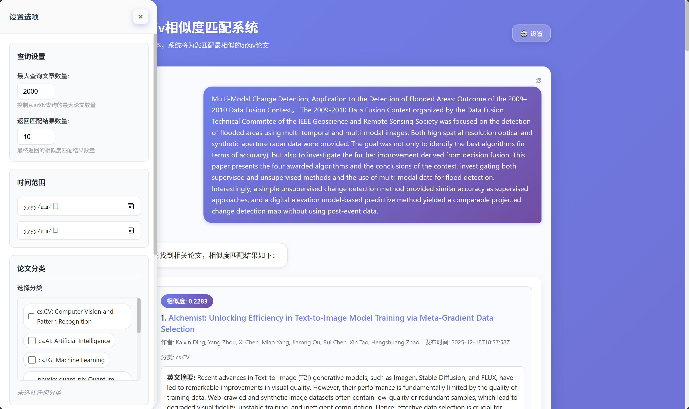

# arXiv相似度匹配系统

一个基于Flask开发的arXiv论文相似度匹配系统，支持文本匹配、分类过滤、大模型翻译等功能。通过输入论文的标题和摘要，系统可以智能匹配最相似的arXiv论文，并提供中文摘要翻译。

# 效果展示



## 📋 推荐改进方向

本项目目前实现了基础的论文相似度匹配功能，以下是一些推荐的改进方向，欢迎贡献：

### 1. 相似度匹配算法升级
- **集成预训练模型**：从Hugging Face下载并集成专门的论文嵌入模型（如SciBERT、SPECTER）
- **语义相似度**：使用Sentence-BERT等模型实现更精准的语义相似度匹配
- **多模态匹配**：支持图表、公式等多模态内容的相似度计算
- **细粒度分类**：使用重分类大模型对论文进行更细粒度的主题分类

### 2. 文献管理功能
- **一键入库**：集成Zotero、Mendeley等文献管理软件API，实现论文一键导入
- **批量翻译**：支持批量翻译论文摘要和关键段落
- **自动笔记生成**：使用大模型自动生成文献阅读笔记和要点总结
- **知识图谱**：构建论文引用关系图谱，可视化展示学术脉络

### 3. 智能推荐系统
- **个性化推荐**：基于用户历史查询和阅读记录进行个性化论文推荐
- **热点追踪**：自动追踪特定领域的最新研究热点
- **相关论文发现**：基于引用关系推荐相关论文

### 4. 用户体验优化
- **PDF预览**：集成PDF在线预览功能
- **高亮标注**：支持对匹配关键词的高亮显示
- **导出功能**：支持将匹配结果导出为PDF、Word、BibTeX等格式
- **协作功能**：支持多用户协作，分享和讨论论文

## 功能特性

### 1. 核心功能
- **分类管理**：抓取并缓存arXiv分类列表，支持按学科过滤
- **查询构建**：支持时间范围、分类过滤、关键词搜索
- **分页处理**：批量获取策略，避免单次请求过多数据
- **相似度匹配**：多种算法支持（余弦相似度、Jaccard相似度、词频相似度）
- **大模型集成**：支持英文摘要翻译为中文总结
- **灵活配置**：支持自定义查询数量和返回结果数量

### 2. Web界面
- **ChatGPT式界面**：提供类似ChatGPT的对话窗口设计
- **实时交互**：支持直接输入文本或使用示例文本
- **响应式设计**：适配不同屏幕尺寸
- **结果可视化**：清晰展示匹配结果，包含相似度分数、论文详情和中文摘要
- **侧边栏设置**：便捷的设置面板，支持实时调整参数

### 3. 增强功能
- **类别选择组件**：支持多类别并行选择，包括计算机视觉、人工智能、量子物理等
- **大模型配置**：支持模型参数调整（温度、Top-P等）
- **论文链接**：直接链接到arXiv官方页面，方便查看完整论文
- **本地持久化**：用户配置和选择状态本地存储，下次访问自动加载
- **查询数量控制**：
  - **最大查询文章数量**：控制从arXiv查询的最大论文数量（默认20篇，可调整1-100篇）
  - **返回匹配结果数量**：控制最终返回的相似度匹配结果数量（默认10篇，可调整1-50篇）

## 技术栈

- **后端框架**：Flask 3.1.2
- **核心库**：
  - requests：HTTP请求
  - beautifulsoup4 + lxml：网页解析
  - cachetools：缓存管理
  - python-dotenv：环境变量管理
- **前端技术**：HTML5、CSS3、JavaScript（原生）
- **模板引擎**：Jinja2
- **开发环境**：Python 3.12+
- **API集成**：SiliconFlow（支持多种大模型）

## 安装指南

### 1. 克隆仓库
```bash
git clone <repository-url>
cd arxiv-similarity-system
```

### 2. 安装依赖
```bash
pip install -r requirements.txt
```

### 3. 配置环境变量

**⚠️ 重要提示**：请务必将 `.env.example` 文件复制并重命名为 `.env`，然后填写您的API密钥。

复制环境变量模板：
```bash
cp .env.example .env
```

编辑`.env`文件，添加必要的环境变量：
```
# SiliconFlow API 配置
# 请前往 https://siliconflow.cn 获取您的 API 密钥
SILICONFLOW_API_KEY=sk-xxxxxxxxxxxxxxxxxxxxxxxxxxxxxxxxxxxxxxxx

# 大模型配置
DEFAULT_MODEL=Qwen/Qwen2.5-7B-Instruct

# 应用配置
PORT=5000
DEBUG=True
```

### 4. 启动应用
```bash
python run.py
```

访问地址：http://127.0.0.1:5000

---

## ⚠️ 开发声明

本项目使用 **TRAE 最简单的 SOLO Agent** 快速开发完成，后续进行了代码重构和功能优化。由于开发时间较短，部分功能可能未经过充分测试，如遇到 Bug 或问题，敬请谅解。

欢迎通过 Issue 或 Pull Request 反馈问题和建议，我们会持续改进和完善项目。感谢您的理解与支持！

---

## 目录结构

```
arxiv/
├── app/                    # 主应用目录
│   ├── __init__.py         # Flask应用初始化和API路由
│   └── main.py             # 命令行交互主函数和辅助函数
├── src/                    # 源代码目录
│   ├── services/           # 服务层
│   │   ├── category.py     # arXiv分类管理（带缓存）
│   │   ├── query.py        # 查询构建器（支持时间、分类、关键词过滤）
│   │   └── pagination.py   # 分页处理器（批量获取论文数据）
│   ├── utils/              # 工具函数
│   │   └── similarity.py   # 相似度匹配（余弦、Jaccard、词频）
│   └── models/             # 数据模型（预留）
├── static/                 # 静态资源
│   ├── css/               # 样式文件
│   ├── js/                # JavaScript文件
│   └── images/            # 图片资源
├── templates/              # HTML模板
│   └── index.html         # 主页面模板（包含完整的前端逻辑）
├── tests/                  # 测试文件
├── test_query.py          # 查询功能测试脚本
├── test_similarity.py     # 相似度匹配测试脚本
├── config/                 # 配置文件（预留）
├── run.py                  # Web应用入口
├── requirements.txt        # 依赖列表
└── .env.example            # 环境变量模板
└── README.md              # 项目说明
```

## 使用说明

### Web界面使用

#### 1. 基本使用流程
1. 在输入框中输入要匹配的论文标题和摘要
2. 或勾选"使用示例文本"使用预设示例
3. 点击右上角"⚙️ 设置"按钮打开侧边栏配置参数
4. 点击"发送"按钮提交查询
5. 查看相似度匹配结果，包括：
   - 相似度分数
   - 论文标题（点击可跳转到arXiv官网）
   - 作者、发布时间、分类信息
   - 英文摘要和中文翻译

#### 2. 侧边栏设置说明

**查询设置**
- **最大查询文章数量**：控制从arXiv查询的论文总数（1-100篇）
  - 默认值：20篇
  - 建议：数量越大查询时间越长，但匹配结果更全面
- **返回匹配结果数量**：控制显示的相似度排名靠前的论文数量（1-50篇）
  - 默认值：10篇
  - 建议：根据实际需求调整，通常5-15篇即可

**时间范围**
- 设置查询的论文发布时间范围
- 默认：查询昨天发布的论文
- 可选择任意开始和结束日期

**论文分类**
- 支持多选arXiv分类
- 默认分类：cs.CV（计算机视觉）、cs.AI（人工智能）、physics.ao-ph（大气和海洋物理）、eess.IV（图像和视频处理）
- 可自定义选择任意分类组合

**大模型配置**
- **服务提供商**：选择API服务提供商（SiliconFlow、OpenAI、Anthropic等）
- **API密钥**：输入对应服务商的API密钥
- **模型名称**：支持下拉选择或手动输入模型名称
- **Temperature**：控制输出随机性（0-1），值越高越随机
- **Top-P**：控制核采样范围（0-1），值越小越聚焦

### 命令行使用

运行命令行交互界面：
```bash
python -m app.main
```

功能菜单：
1. 查看arXiv分类列表
2. 按学科查看分类
3. 搜索文献
4. 相似度匹配
5. 退出程序

### 测试脚本

**测试查询功能**：
```bash
python test_query.py
```

**测试相似度匹配功能**：
```bash
python test_similarity.py
```

## 常见问题

### Q1: 设置了返回10个结果，但只显示了5个？
**A**: 这个问题已在v1.1版本修复。请确保使用最新版本，后端会正确读取前端传递的 `max_results_count` 参数。

### Q2: 如何获取SiliconFlow API密钥？
**A**: 
1. 访问 https://siliconflow.cn
2. 注册并登录账号
3. 在控制台创建API密钥
4. 将密钥配置到 `.env` 文件或Web界面的设置中

### Q3: 翻译失败怎么办？
**A**: 
1. 检查API密钥是否正确配置
2. 确认网络连接正常
3. 检查API额度是否用完
4. 尝试更换其他模型

### Q4: 查询速度慢怎么办？
**A**: 
1. 减少"最大查询文章数量"
2. 缩小时间范围
3. 精确选择相关分类
4. 检查网络连接

### Q5: 如何添加更多分类？
**A**: 修改 `templates/index.html` 中的 `categories` 数组，添加需要的arXiv分类ID和名称。

## 更新日志

### v1.1.1 (2025-12-19)
- ✅ 修复：设置按钮点击无反应的问题
- ✅ 修复：JavaScript语法错误导致的显示问题
- ✅ 新增：推荐改进方向说明
- ✅ 优化：环境配置提示更加明确
- ✅ 新增：开发声明和项目背景说明

### v1.1 (2025-12-19)
- ✅ 修复：前后端返回数量不一致的问题
- ✅ 修复：后端正确使用用户设定的查询数量和返回数量
- ✅ 修复：测试文件导入路径错误
- ✅ 完善：test_similarity.py 测试脚本
- ✅ 新增：.env.example 环境变量模板文件
- ✅ 改进：论文链接提取逻辑，支持多种ID格式
- ✅ 更新：README文档，添加详细使用说明

### v1.0
- 初始版本发布
- 支持arXiv论文相似度匹配
- 集成大模型翻译功能
- Web界面实现

## 开发指南

### 代码规范
- 遵循PEP 8编码规范
- 使用模块化设计
- 添加适当的注释和文档字符串

### 项目架构
- **app/**：Flask应用和路由
- **src/services/**：业务逻辑层
- **src/utils/**：工具函数
- **templates/**：前端模板
- **static/**：静态资源

### 添加新功能
1. 在 `src/` 中创建相应的模块
2. 在 `app/__init__.py` 中添加API路由
3. 在 `templates/index.html` 中添加前端交互
4. 更新 README 文档

## 贡献指南

1. Fork本仓库
2. 创建特性分支 (`git checkout -b feature/AmazingFeature`)
3. 提交更改 (`git commit -m 'Add some AmazingFeature'`)
4. 推送到分支 (`git push origin feature/AmazingFeature`)
5. 创建Pull Request

欢迎提交Issue和Pull Request来改进这个项目！

## 许可证

MIT License

## 联系方式

如有问题或建议，请提交Issue或Pull Request。

---

**注意**：使用本系统前请确保遵守arXiv的使用条款和API使用规范。建议合理控制请求频率，避免对arXiv服务器造成过大负担。